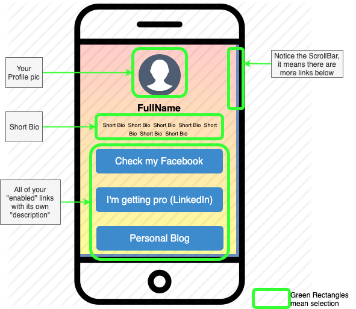
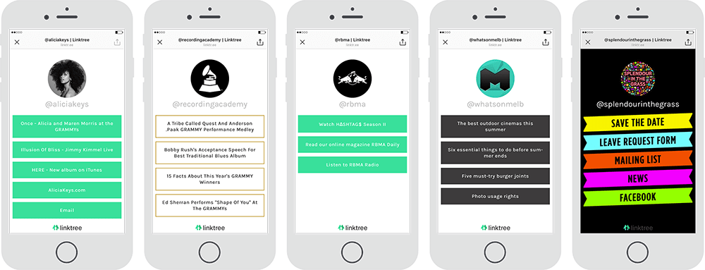

# Description

You will create a [link.tree](https://linktr.ee/) like web page 🤓, it will be a single web page that will contain all the links to your social media / contact / places of interest.

From [link.tree](https://linktr.ee/):
> You get one link to house all the content you’re driving followers to. Share that link anywhere, like your Instagram bio, Facebook posts or Twitch profile.
> Send followers anywhere: articles, webstore, events, socials and more.

# Rules

So obviously for this project you will need:

- multiple destination where you want to send your followers, it might include: LinkedIn profile, Facebook profile, Instagram profile(s), personal blog, web store, etc.
- develop it in Flask
- read the content dynamically via a yaml file (links.yaml)
- generate the buttons with the correct href to *redirect*


# [links.yaml](https://yaml-online-parser.appspot.com/?yaml=picture%3A+%22static%2Ffilename_of_your_selfie.%5Bpng%7Cjpg%5D%22%0Ashortbio%3A+%22brief+paragraph+that+contains+your+short+bio%22%0A%0A%0Alinks%3A%0A++++-+facebook%3A%0A++++++++enable%3A+True%0A++++++++link%3A+%22https%3A%2F%2Furl_to_your.facebook.profile%22%0A++++++++description%3A+%22check+my+facebook%22%0A++++-+instagram%3A%0A++++++++enable%3A+True%0A++++++++link%3A+%22https%3A%2F%2Furl_to_your.instagram.profile%22%0A++++++++description%3A+%22How+Cool+my+photos+are+in+instagram+%3Acamera%3A%22%0A++++-+blog%3A%0A++++++++enable%3A+False%0A++++++++link%3A+%22lorem+ipsum%22%0A++++++++description%3A+%22lorem+ipsum+dorem%22%0A++++-+etc%3A%0A++++++++enable%3A+False%0A++++++++link%3A+%22http%3A%2F%2Fetc.etc%22%0A++++++++description%3A+%22any+other+link+you+want+your+followers+to+see%22&type=json)

[watch it online](https://yaml-online-parser.appspot.com/?yaml=picture%3A+%22static%2Ffilename_of_your_selfie.%5Bpng%7Cjpg%5D%22%0Ashortbio%3A+%22brief+paragraph+that+contains+your+short+bio%22%0A%0A%0Alinks%3A%0A++++-+facebook%3A%0A++++++++enable%3A+True%0A++++++++link%3A+%22https%3A%2F%2Furl_to_your.facebook.profile%22%0A++++++++description%3A+%22check+my+facebook%22%0A++++-+instagram%3A%0A++++++++enable%3A+True%0A++++++++link%3A+%22https%3A%2F%2Furl_to_your.instagram.profile%22%0A++++++++description%3A+%22How+Cool+my+photos+are+in+instagram+%3Acamera%3A%22%0A++++-+blog%3A%0A++++++++enable%3A+False%0A++++++++link%3A+%22lorem+ipsum%22%0A++++++++description%3A+%22lorem+ipsum+dorem%22%0A++++-+etc%3A%0A++++++++enable%3A+False%0A++++++++link%3A+%22http%3A%2F%2Fetc.etc%22%0A++++++++description%3A+%22any+other+link+you+want+your+followers+to+see%22&type=json)


```yaml
# point to your own profile pic you want to display in your link.my.bio
picture: "static/filename_of_your_selfie.[png|jpg]"

# it will appear just below your picture.
name: "Your Full Name"
# short auto biography about yourself
shortbio: "brief paragraph that contains your short bio"

# 'links' will be an array of any amount of links you want your followers to discover, notice that the name will be mere descriptive (it is not necesarily functional.)
# each link will have 3 attributes:
# - enable: this will tell your app to display/hide this link in your "link.my.bio"
# - link: this is the link you want to "redirect" your users to, when they click on the button
# - description: this will appear as the text in the button of your link

links:
    - facebook:
        enable: True
        link: "https://url_to_your.facebook.profile"
        description: "check my facebook"
    - instagram:
        enable: True
        link: "https://url_to_your.instagram.profile"
        description: "How Cool my photos are in instagram :camera:"
    - blog:
        enable: False
        link: "lorem ipsum"
        description: "lorem ipsum dorem"
    - etc:
        enable: False
        link: "http://etc.etc"
        description: "any other link you want your followers to see"

```
> notice that the order of the attributes is irrelevant, what matters is that they should exist.

# Example

## Example-1
<br>

All parts explained and showed. Mobile showed to reflect the [responsiveness](https://www.w3schools.com/html/html_responsive.asp) , but it should work in Desktop as well 😉.
<br><br><br>



## Example-2
<br>

See you can add any style to your own project. These are only ideas.
<br><br><br><br>




# Requirements

- [ ] **FORK** THIS REPO!
- [ ] Your project will read the links.yaml file and generate the webpage to start serving it as desired.
- [ ] Project MUST compile
- [ ] Update README.md to add a section `Usage`, where you will place the commands in order to run your bio.py
- [ ] Add Style, suggestions "bootstrap.css"
- [ ] Deliver it via `git tags`
- [ ] Make sure to use/develop/fill the empty files/folders provided: `static/`, `templates/`, `bio.py` , `requirements.txt`.


# Usage

> put your code here


# Extras:
- You can **add** any other attribute you like in order to add more functionalities.
- Create a "timer" per link, in a new attribute called `until` you will put a date `2019/9/30 20:30:00` which will mean that this specific link will only appear until that date, and after that date it will disappear.
- Deploy this to real life (AWS lambda, Google Cloud Functions, Heroku)
- Add CI/CD
- Modularize it
- Create a `POST` endpoint `/link` (ideally with basic-auth) that will allow you to create a new link given a JSON request data.

```bash
curl -d @link.json -X POST  \
     -H "Content-Type: application/json" http://localhost:5000/link
```

```json
//link.json:
{
      "youtube_video_sport": {
        "enable": true,
        "link": "https://url_to_your.youtube.video",
        "description": "check my latest video in youtube"
      }
}
```